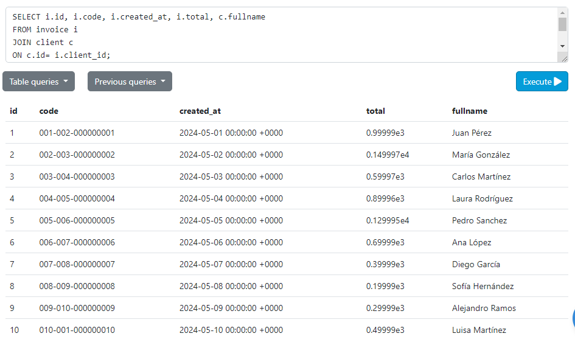
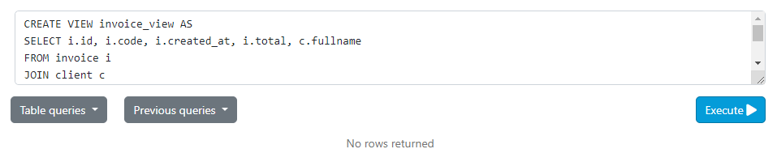
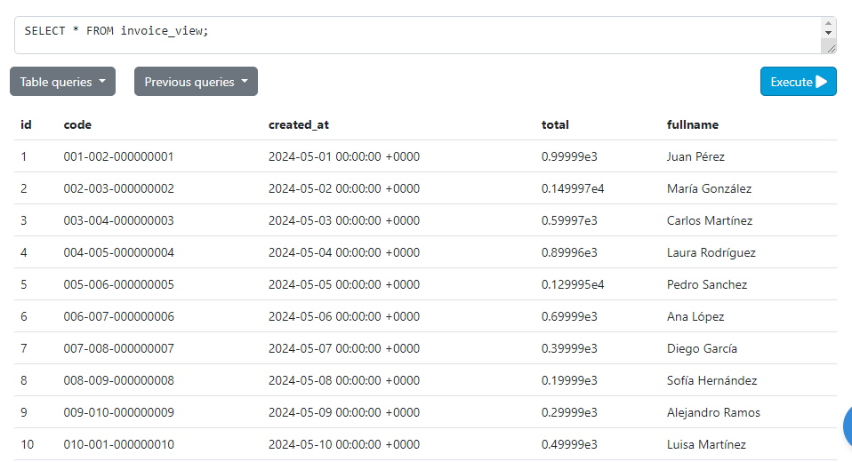
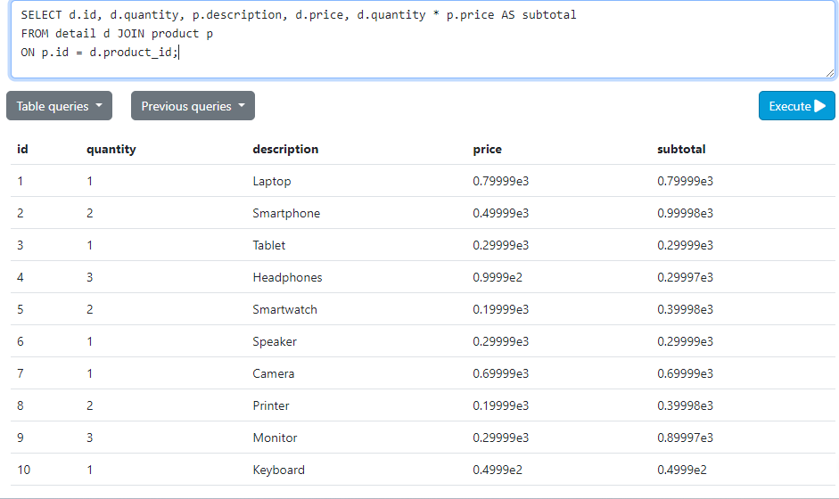
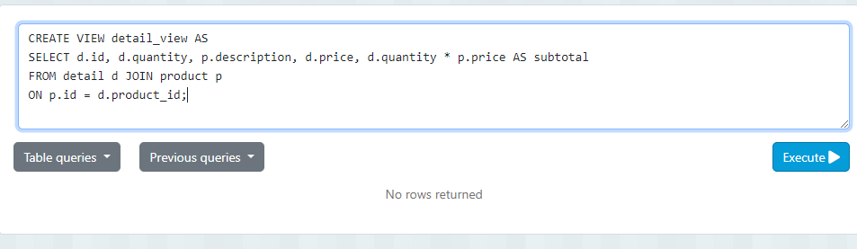
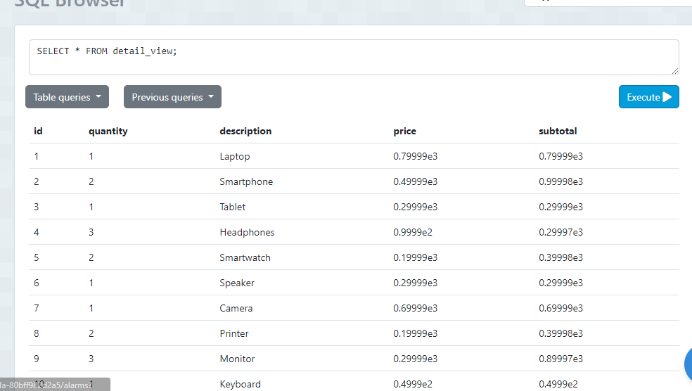

# Tarea TAS11 - views

## INVOICE_VIEW
## Visualizar la tabla invoice view antes de crear
- Sentencia:
```
SELECT i.id, i.code, i.created_at, i.total, c.fullname
FROM invoice i 
JOIN client c 
ON c.id= i.client_id;
```
- Captura:


## Guardar el view de invoice para buscarlo solo con select

- Sentencia:
```
CREATE VIEW invoice_view AS
SELECT i.id, i.code, i.created_at, i.total, c.fullname
FROM invoice i 
JOIN client c 
```
- Captura:



## Buscar con Select el invoice_view
- Sentencia:
```
SELECT * FROM invoice_view;
```
- Captura:


## DETAIL_VIEW

## Visualizar el view de detail para buscarlo solo con select
- Sentencia:
```
SELECT d.id, d.quantity, p.description, d.price, d.quantity * p.price AS subtotal
FROM detail d JOIN product p
ON p.id = d.product_id;
```
- Captura:


## Guardar el view de detail para buscarlo solo con select

- Sentencia:
```
CREATE VIEW detail_view AS
SELECT d.id, d.quantity, p.description, d.price, d.quantity * p.price AS subtotal
FROM detail d JOIN product p
ON p.id = d.product_id;
```
- Captura:


## Buscar con Select el detail_view
- Sentencia:
```
SELECT * FROM detail_view;
```
- Captura:

