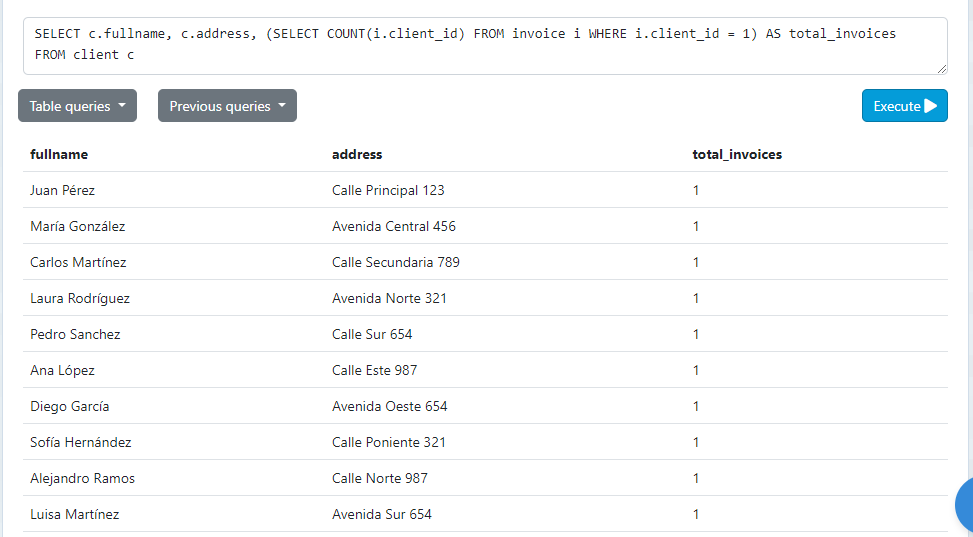
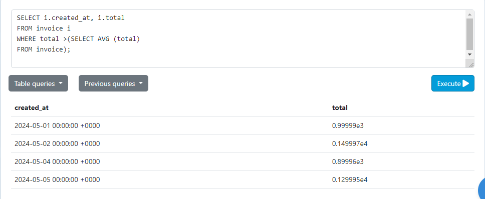

# Tarea TAS12 - Subconsultas


## Sunconsulta 1
- Sentencia:
```
SELECT c.fullname, c.address, (SELECT COUNT(i.client_id) FROM invoice i WHERE i.client_id = 1) AS total_invoices
FROM client c
```
- Captura:


## Subconsulta en la clausula WHERE
- Sentencia:
```
SELECT i.created_at, i.total
FROM invoice i
WHERE total >(SELECT AVG (total)
FROM invoice);
```
- Captura:


## Listar nombres y correo de los clientes junto a su compra mas cara realizada
- Sentencia:
```

```
- Captura:
