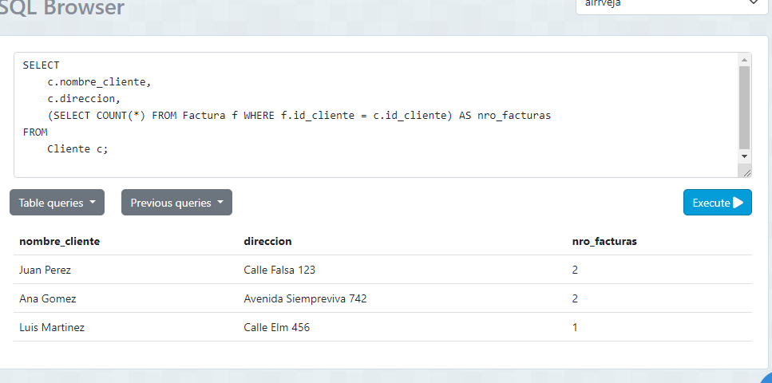
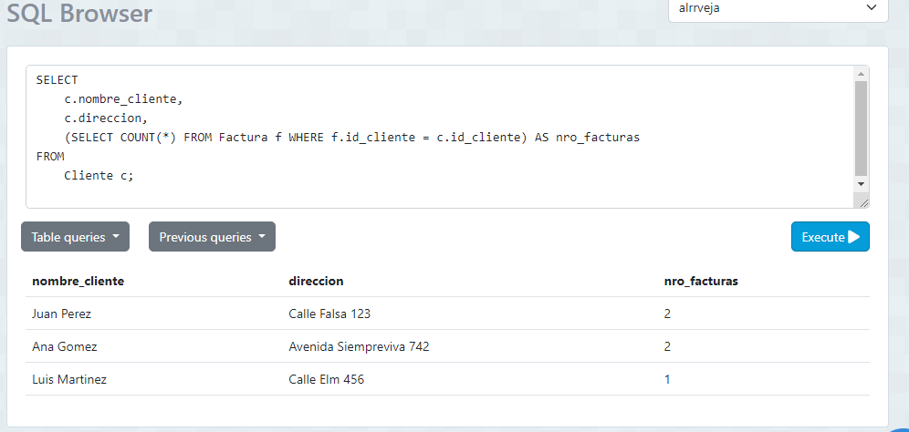
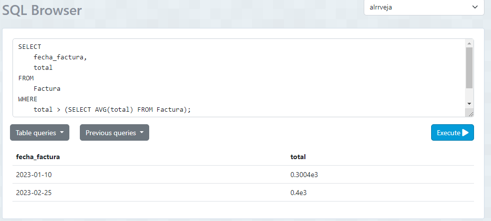
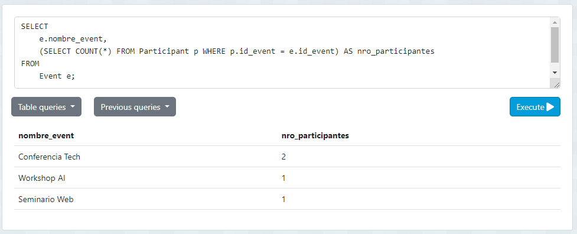
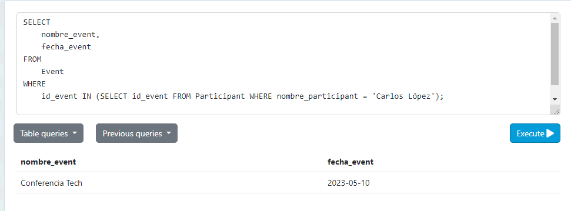

# Tarea TAS12 - Subconsultas

## DB INVOICE

### El numero total de facturas realizadas por cada cliente.
- Sentencia:
```
SELECT 
    c.nombre_cliente, 
    c.direccion, 
    (SELECT COUNT(*) FROM Factura f WHERE f.id_cliente = c.id_cliente) AS nro_facturas
FROM 
    Cliente c;
```
- Captura:


### Listar nombre y correo de los clientes junto a su compra mas cara realizada.
- Sentencia:
```
SELECT 
    c.nombre_cliente, 
    c.direccion, 
    (SELECT COUNT(*) FROM Factura f WHERE f.id_cliente = c.id_cliente) AS nro_facturas
FROM 
    Cliente c;
```


### Listar las facturas donde sus totales sean mayores al promedio de las facturas
- Sentencia:
```
SELECT 
    fecha_factura, 
    total 
FROM 
    Factura 
WHERE 
    total > (SELECT AVG(total) FROM Factura);

```


## DB EVENT

### Crear dos ejemplo con la base de datos event. Uno en SELECT y otro en WHERE
#### SELECT
- Sentencia:
```
SELECT 
    e.nombre_event, 
    (SELECT COUNT(*) FROM Participant p WHERE p.id_event = e.id_event) AS nro_participantes
FROM 
    Event e;
```


#### WHERE
- Sentencia:
```
SELECT 
    nombre_event, 
    fecha_event 
FROM 
    Event 
WHERE 
    id_event IN (SELECT id_event FROM Participant WHERE nombre_participant = 'Carlos López');
```
