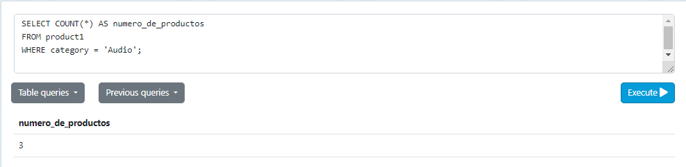
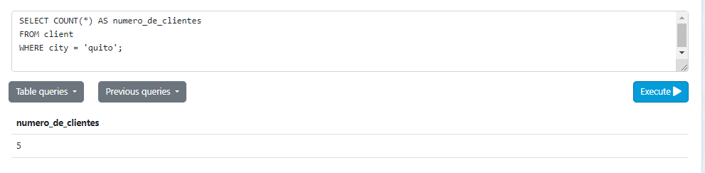
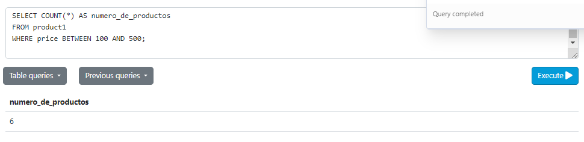
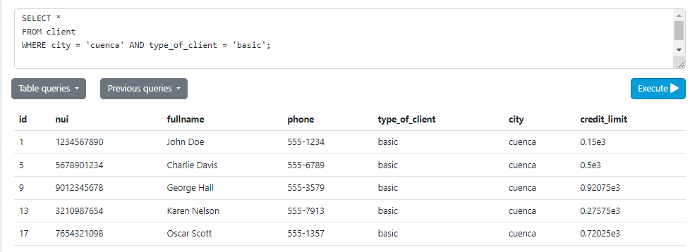
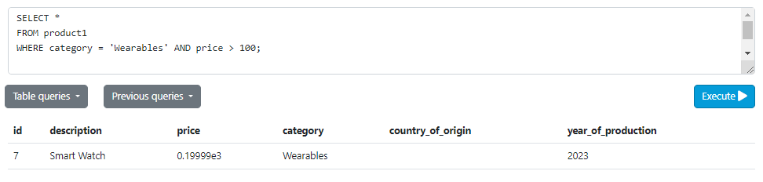
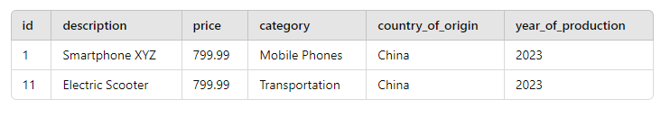
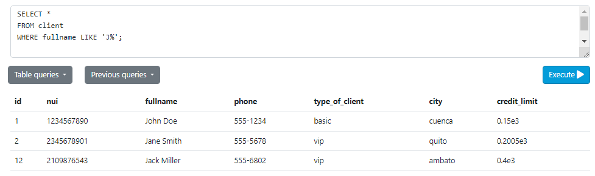
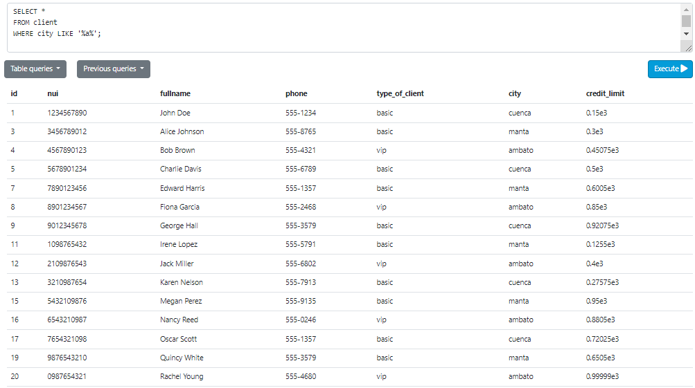

# Tarea TAS8

## Contar el número de productos de una categoría específica
- Sentencia:
```
SELECT COUNT(*) AS numero_de_productos
FROM product1
WHERE category = 'Audio';
```
- Captura:


## Contar el número de clientes en una ciudad específica

- Sentencia:
```
SELECT COUNT(*) AS numero_de_clientes
FROM client
WHERE city = 'quito';
```
- Captura:


## Contar el número de productos cuyo precio está dentro de un rango específico 
- Sentencia:
```
SELECT COUNT(*) AS numero_de_productos
FROM product1
WHERE price BETWEEN 100 AND 500;
```
- Captura:


## Seleccionar clientes que viven en una ciudad específica y tienen un tipo de cliente específico
- Sentencia:
```
SELECT *
FROM client
WHERE city = 'cuenca' AND type_of_client = 'basic';
```
- Captura:


## Seleccionar productos que pertenecen a una categoría específica y cuyo precio está por encima de un valor específico
- Sentencia:
```
SELECT *
FROM product1
WHERE category = 'Wearables' AND price > 100;
```
- Captura:


## Seleccionar productos que fueron producidos en un año específico y en un país de origen específico
- Sentencia:
```
SELECT *
FROM product1
WHERE year_of_production = 2023 AND country_of_origin = 'China';
```
- Captura:


## Seleccionar clientes cuyo nombre completo comience con 'J'.
- Sentencia:
```
SELECT *
FROM client
WHERE fullname LIKE 'J%';
```
- Captura:


## Seleccionar clientes cuya ciudad contenga la letra 'a'
- Sentencia:
```
SELECT *
FROM client
WHERE city LIKE '%a%';
```
- Captura:

