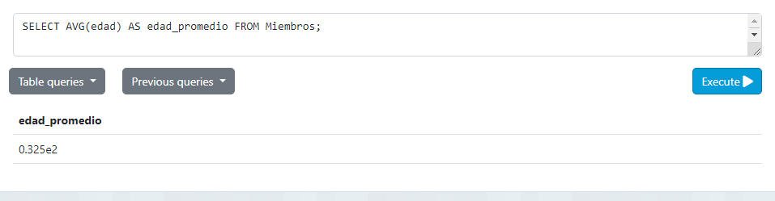
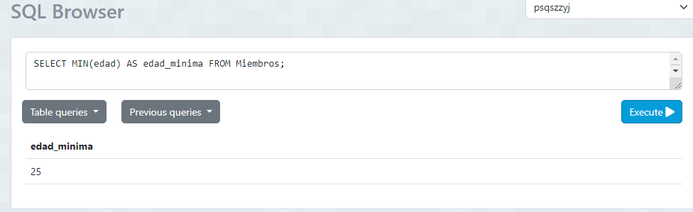
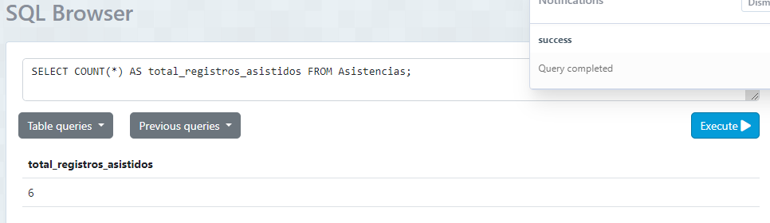
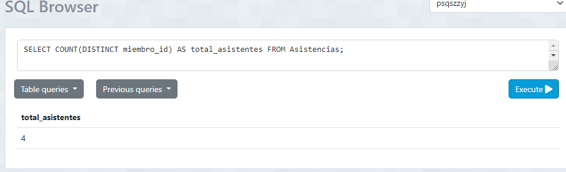
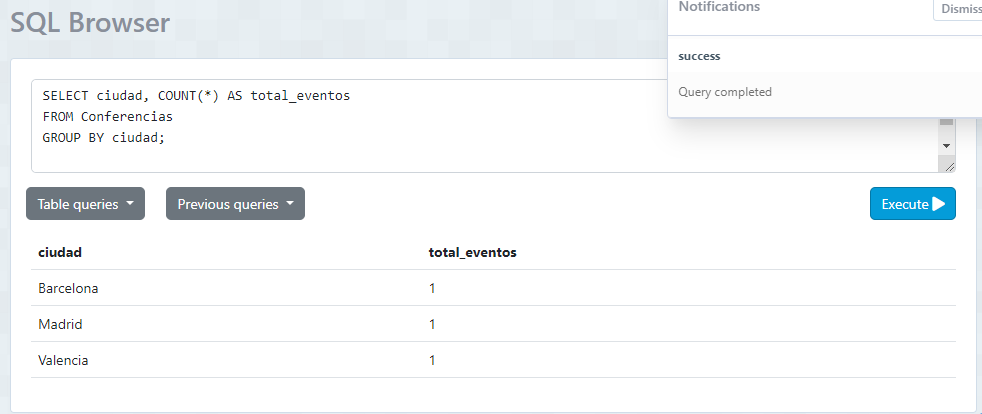
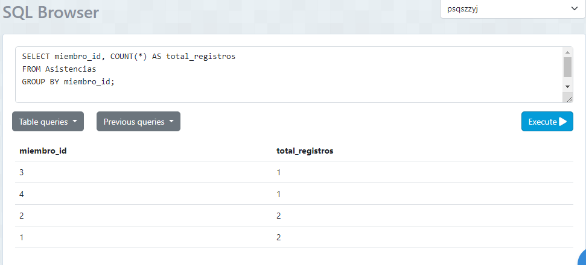
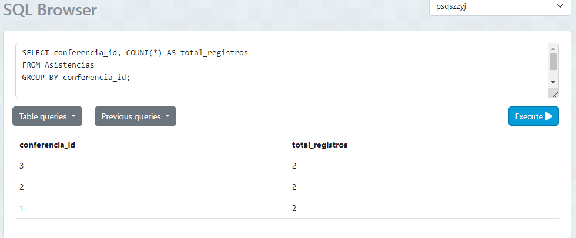

# Tarea TAS9

## obtener la edad promedio de los miembros:
- Sentencia:
```
SELECT AVG(edad) AS edad_promedio FROM Miembros;
```
- Captura:


## obtener la edad mínima de los miembros:
- Sentencia:
```
SELECT MIN(edad) AS edad_minima FROM Miembros;
```
- Captura:


## obtener el número total de registros asistidos:
- Sentencia:
```
SELECT COUNT(*) AS total_registros_asistidos FROM Asistencias;
```
- Captura:


## obtener el número total de asistentes a todas las conferencias
- Sentencia:
```
SELECT COUNT(DISTINCT miembro_id) AS total_asistentes FROM Asistencias;
```
- Captura:


## obtener el número total de eventos por cada ciudad:
- Sentencia:
```
SELECT ciudad, COUNT(*) AS total_eventos 
FROM Conferencias 
GROUP BY ciudad;
```
- Captura:


## obtener el número de registros por cada miembro:
- Sentencia:
```
SELECT miembro_id, COUNT(*) AS total_registros 
FROM Asistencias 
GROUP BY miembro_id;
```
- Captura:


## obtener el número de registros por cada conferencia:
- Sentencia:
```
SELECT conferencia_id, COUNT(*) AS total_registros 
FROM Asistencias 
GROUP BY conferencia_id;
```
- Captura:
